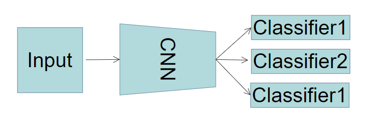

# Computer-Vision
all of the experiments are done in jupyer notebook, run the code block in every .ipynb blocks one by one to train and test the models.
## Basic Network
Below is the structure of three different blocks in ResNet, GoogLeNet and ResNeXt.

In this experiment, VGG, ResNet, GoogLeNet and ResNeXt are implemented with PyTorch and train/test on CIFAR-10.
|Model | Accuracy | Parameters | 
| :---- | ----: | :----: | 
VGG11 | 0.766 | 28M 
VGG16| 0.790 | 33M
ResNet18 | 0.892  | 11M
GoogLeNet | 0.759 | 6M 
ResNeXt | 0.913 | 34M 

Here is the loss curve and accuracy curve of ResNet18. More curve are in ./basic_network/CNN.ipynb .

## Image Classification
Two methods are used to do the classification: ResNet18 and Swin-Transformer. The model of RsNet18 has been implemented in ./basic_network,
but the Swin-Transformer is implemented based on timm, which is open source on github.

The structure of Swin Transformer is below:

Below is the loss and accuracy curve of resnet18 and swin transformer on cat-dog dataset.

ResNet18 curve:

Swin Transformer curve:

|Model | Accuracy | Parameters | 
| :---- | ----: | :----: | 
   ResNet18 | 0.966  | 11M
   Swin Transformer | 0.996 | 28M 

## Fine-grained

## Multi-Label
We use two methods : CNN and C-Tran

CNN multi-clssifier:

The dataset is 'Fashion Product Images' on Kaggle. We used three labels: gender, articleType and baseColour. Here is the predict demo:

|Category | Accuracy | 
| :---- | ----: | 
   gender | 0.64  
   articleType |  0.89 
   baseColour | 0.83  

C-Tran:
The structure of it is below:

|Index | Accuracy | 
| :---- | ----: | 
  mAP | 0.64  
   CF1 |  0.89 
   OF1 | 0.83  
